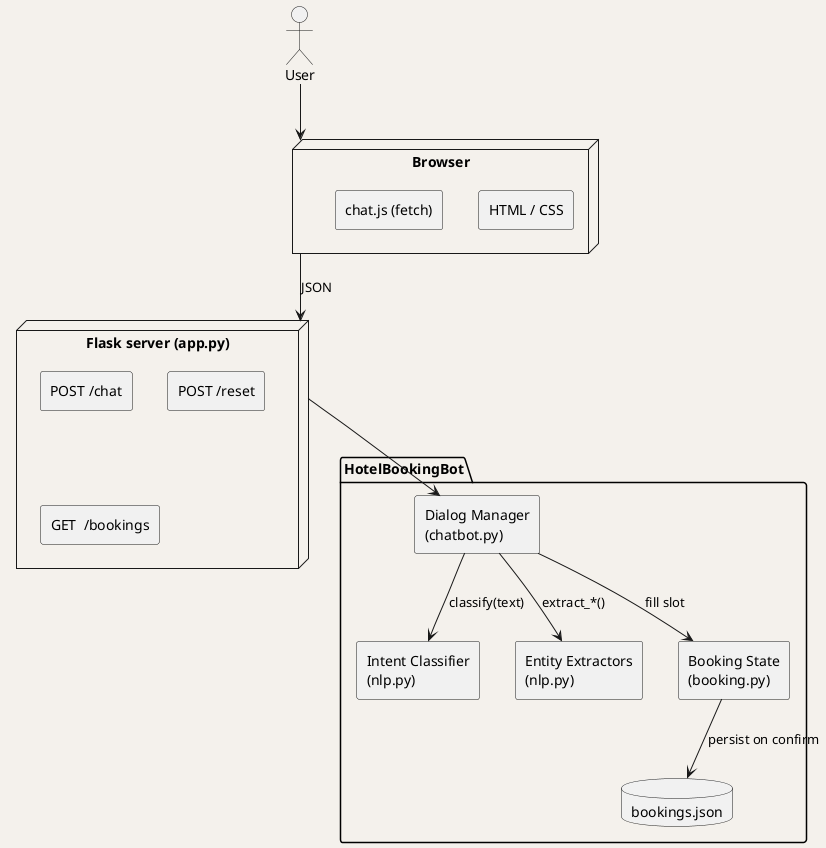
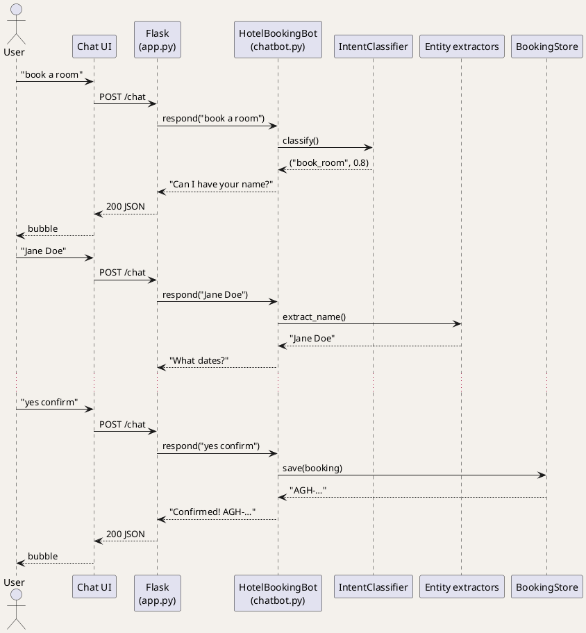
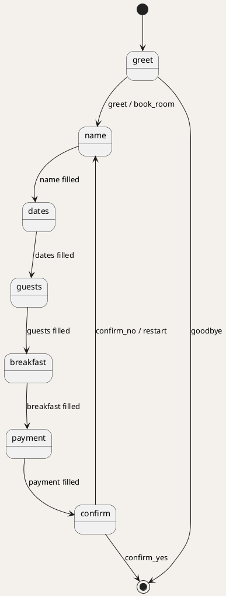

# UML Diagrams (source)

The diagrams in the phase-1 PDF were generated from the PlantUML source
below. You can re-render them at <https://www.plantuml.com/plantuml/> or
via any local PlantUML install.

---

## 1. Component diagram

## 2. Sequence diagram (happy-path booking)

## 3. State diagram (dialog slots)

